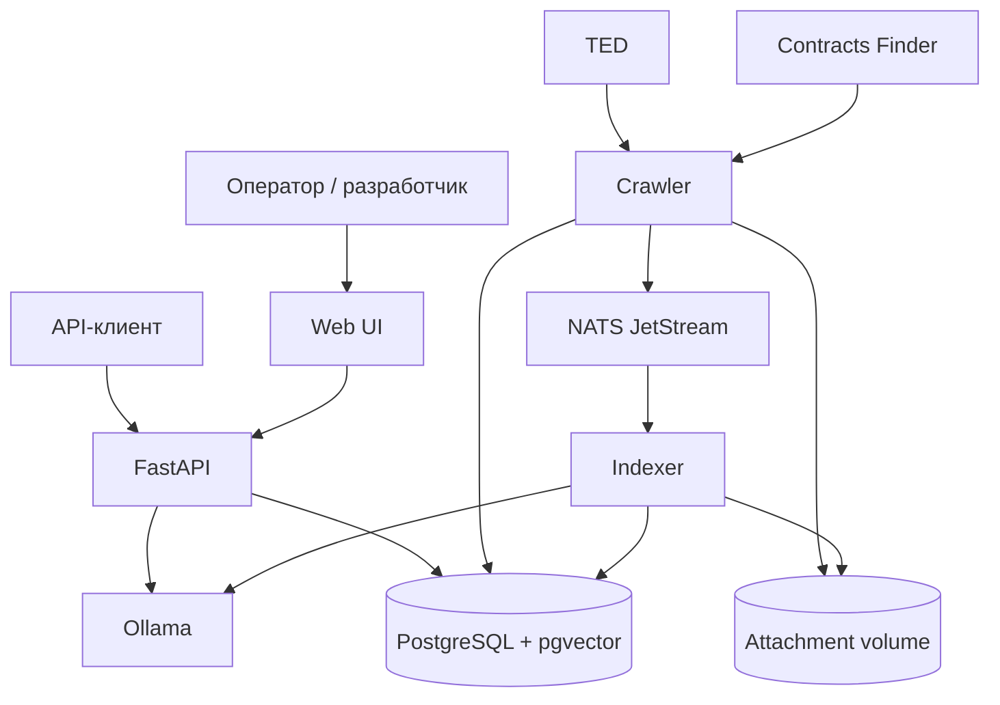
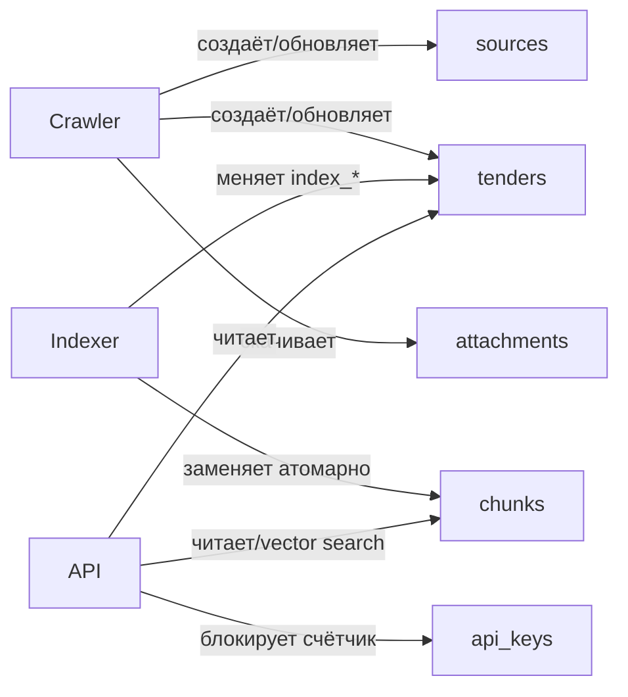

# Обзор архитектуры

<p class="tl-lede">TenderLens — минимально распределённое событийное приложение: три процесса разделяют один домен и одну БД, а медленная индексация отделена durable-очередью.</p>

## Контекст системы



## Почему три роли, а не три проекта

Пакет `tender_lens` содержит общие модели, контракты, настройки и интеграции. Один Docker image запускается разными командами. Это исключает копирование типов и упрощает тестовое задание, но оставляет процессную изоляцию там, где она действительно нужна.

| Роль | Вход | Выход | Может перезапускаться независимо |
|---|---|---|---|
| crawler | внешние HTTP API, cursor | rows, files, NATS event | да |
| indexer | durable NATS event | chunks, embeddings, index status | да |
| API | HTTP request | JSON/UI response | да |

Crawler не ждёт embeddings. API не извлекает документы. Indexer не обращается к внешним реестрам.

## Владение данными



Владение здесь означает «кто имеет право менять основное состояние», а не отдельную физическую БД. Ограничение поддерживается слоями сервиса и тестами.

## Слои Python-пакета

```text
entrypoints     crawler/__main__.py · indexer/__main__.py · api/main.py · cli.py
orchestration   crawler/service.py  · indexer/service.py  · search.py
adapters        crawler/ted.py      · crawler/contracts_finder.py · ai.py
domain          schemas.py          · hashing.py           · errors.py
persistence     models.py           · db.py                · migrations/
infrastructure  nats.py             · storage.py           · logging.py
presentation    api/routes.py       · web/
```

Зависимости направлены преимущественно сверху вниз. Доменные схемы не открывают соединения, импорт модулей не должен требовать PostgreSQL/NATS/Ollama, а connection lifecycle создаётся в entrypoint или FastAPI lifespan.

## Синхронные и асинхронные границы

- Сетевой I/O и SQLAlchemy работают через `asyncio`.
- Ограниченная параллельность — `asyncio.BoundedSemaphore`, а не OS threads.
- Извлечение PDF сейчас синхронное и выполняется внутри indexer; для больших документов это известная граница MVP.
- NATS отделяет ingestion от embeddings и обеспечивает at-least-once delivery.
- HTTP Search/Ask синхронны с точки зрения клиента и не проходят через NATS.

## Инварианты

**Инвариант** — условие, которое должно оставаться истинным при повторе, сбое или конкуренции.

| Инвариант | Механизм | Реализация |
|---|---|---|
| закупка уникальна внутри источника | unique `(source_id, external_id)` | [`Tender`](https://github.com/komaroffsergei/tender-lens/blob/main/src/tender_lens/models.py#L58-L111) |
| событие относится к версии данных | `content_hash` в row и event | [`TenderChangedV1`](https://github.com/komaroffsergei/tender-lens/blob/main/src/tender_lens/schemas.py#L102-L117) |
| старое событие не побеждает новое | повторная hash-проверка под row lock | [`IndexerService.process()`](https://github.com/komaroffsergei/tender-lens/blob/main/src/tender_lens/indexer/service.py#L70-L151) |
| незавершённый publish восстанавливается | `index_status=pending` | [`republish_pending()`](https://github.com/komaroffsergei/tender-lens/blob/main/src/tender_lens/crawler/service.py#L234-L247) |
| файлы не видны частично | `.part` + `fsync` + `os.replace` | [`download_attachment()`](https://github.com/komaroffsergei/tender-lens/blob/main/src/tender_lens/storage.py#L46-L99) |
| лимит атомарен между API-процессами | PostgreSQL `FOR UPDATE` | [`consume_rate_limit()`](https://github.com/komaroffsergei/tender-lens/blob/main/src/tender_lens/api/rate_limit.py#L42-L81) |

## Технологический словарь

- [FastAPI](https://fastapi.tiangolo.com/) — HTTP routing, dependency injection и OpenAPI.
- [SQLAlchemy asyncio](https://docs.sqlalchemy.org/en/20/orm/extensions/asyncio.html) — async ORM/session layer.
- [PostgreSQL](https://www.postgresql.org/docs/) — транзакционное состояние.
- [pgvector](https://github.com/pgvector/pgvector) — тип `VECTOR` и cosine distance operator.
- [NATS JetStream](https://docs.nats.io/nats-concepts/jetstream) — durable stream и explicit ACK.
- [Ollama API](https://docs.ollama.com/api/introduction) — локальные embeddings и generation.
- [httpx](https://www.python-httpx.org/async/) — асинхронный HTTP-клиент.
- [Pydantic](https://docs.pydantic.dev/latest/) — runtime-валидация контрактов.

Конкретное значение каждого термина в проекте раскрыто в [глоссарии](glossary.md).
