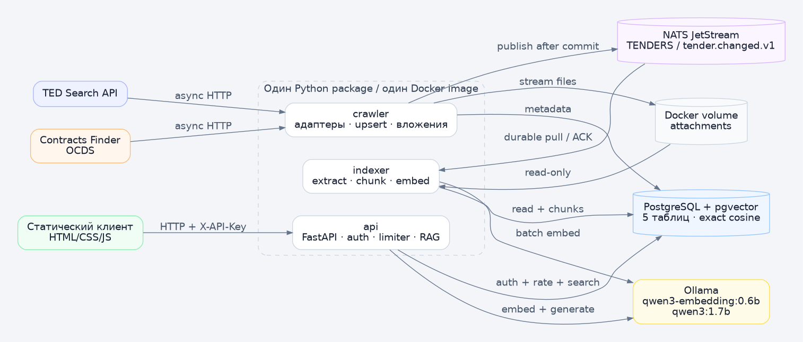
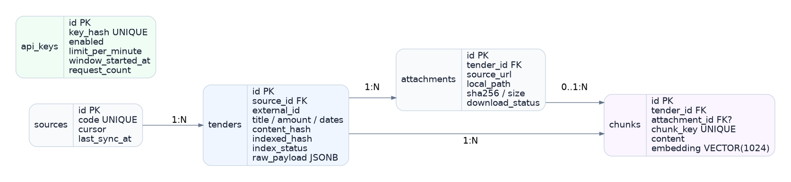
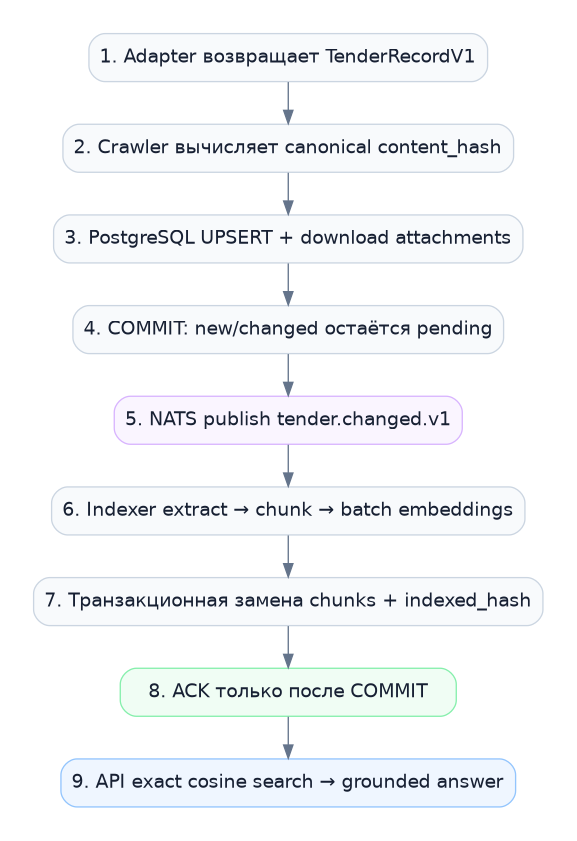

# Архитектура TenderLens

## Цель

Система регулярно получает закупки из двух открытых источников, сохраняет нормализованные метаданные и вложения, асинхронно строит векторный индекс и предоставляет защищённый semantic search и grounded RAG.



## Архитектурный стиль

TenderLens — минимально распределённое событийное приложение:

- один monorepo;
- один Python package и Docker image;
- три independently running роли: `crawler`, `indexer`, `api`;
- один PostgreSQL с `pgvector`;
- один NATS JetStream subject;
- один общий volume вложений;
- опциональный Ollama.

Это сознательно проще строгих микросервисов с отдельными БД, RPC и outbox/inbox. Процессная граница оставлена только вокруг медленной фоновой индексации.

## Компоненты

### `crawler`

- вызывает `TedAdapter` и `ContractsFinderAdapter`;
- применяет общую HTTP-политику;
- нормализует данные в `TenderRecordV1`;
- вычисляет `content_hash`;
- выполняет idempotent `UPSERT`;
- скачивает вложения потоково;
- публикует `tender.changed.v1` после commit;
- повторно публикует записи `pending`;
- продвигает cursor только после успешной порции.

### `indexer`

- использует durable pull consumer JetStream;
- читает сохранённую закупку и вложения;
- извлекает текст;
- режет текст на chunks;
- создаёт embeddings пакетно;
- атомарно заменяет старый индекс;
- выполняет ACK только после commit;
- пропускает stale и уже обработанные события.

### `api`

- раздаёт статический UI;
- проверяет `X-API-Key`;
- применяет PostgreSQL fixed-window rate limiter;
- читает карточки закупок;
- выполняет exact cosine search;
- для `/ask` передаёт только retrieval context в генеративную модель;
- возвращает стабильные ошибки с `request_id`.

## Инфраструктура

### PostgreSQL + pgvector

Пять application tables:

```text
sources
  └── tenders
        ├── attachments
        └── chunks
api_keys
```



`chunks.embedding` имеет тип `VECTOR(1024)`. В MVP используется exact scan оператором cosine distance `<=>`.

### NATS JetStream

```text
Stream: TENDERS
Subject: tender.changed.v1
Consumer: INDEXER
Storage: file
Delivery: pull
ACK: explicit
ACK wait: 300 seconds
Max delivery: 5
Semantics: at least once
```

Payload содержит только `tender_id`, `content_hash` и технические поля контракта. Файлы и полная закупка через NATS не передаются.

### Attachment volume

Crawler пишет в `/data/attachments`, indexer читает тот же volume. Путь строится из UUID закупки и вложения; имя очищается от traversal и недопустимых символов.

### Ollama

Один endpoint обслуживает batch embeddings и generation. В `AI_MODE=fake` используется детерминированный provider, поэтому CI не зависит от моделей.

## Последовательность ingestion



1. Crawler получает страницу источника.
2. Каждая валидная запись нормализуется. Некорректная запись логируется и изолируется.
3. Закупка и метаданные вложений фиксируются в БД.
4. Вложения скачиваются во временный файл и атомарно перемещаются.
5. Для новой/изменённой закупки публикуется событие.
6. Indexer извлекает текст и создаёт embeddings.
7. В транзакции старые chunks заменяются новыми.
8. После commit indexer ACK-ает сообщение.

## Идемпотентность и восстановление

| Ситуация | Механизм |
|---|---|
| повторный crawl | unique `(source_id, external_id)` + `content_hash` |
| publish упал после DB commit | `index_status=pending`, `republish_pending()` |
| indexer упал до commit | нет ACK, JetStream redelivery |
| indexer упал после commit до ACK | `indexed_hash == event.content_hash` |
| пришло старое событие | сравнение event hash с текущим `content_hash` |
| старая попытка завершилась ошибкой после обновления tender | failed записывается только при совпадении `content_hash` |
| reindex упал | старые chunks удаляются только внутри финальной транзакции |

## Границы доверия

- JSON/HTML/XML/PDF внешних источников считаются недоверенными данными.
- Redirect разрешён только на allowlist host.
- XML разбирается через `defusedxml`.
- RAG prompt явно запрещает исполнять инструкции из документов.
- API-ключ в UI хранится только в `sessionStorage` и передаётся заголовком.
- В логах и ошибках не выдаются DSN, key hash и локальные пути.

## Почему API не ходит через NATS

Search и Ask являются синхронными пользовательскими запросами. NATS request/reply добавил бы timeout, responder lifecycle и новый контракт без полезного выигрыша. NATS используется только для длительной фоновой индексации, где durable queue действительно нужна.
