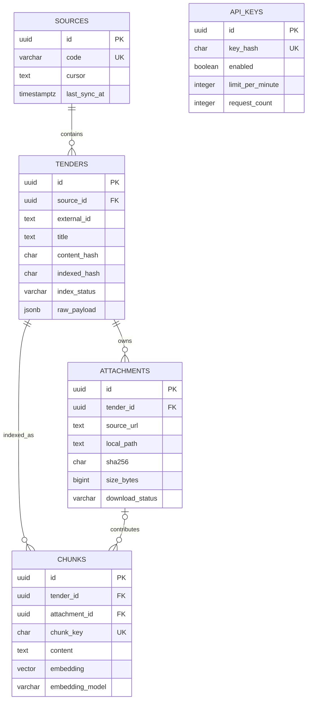
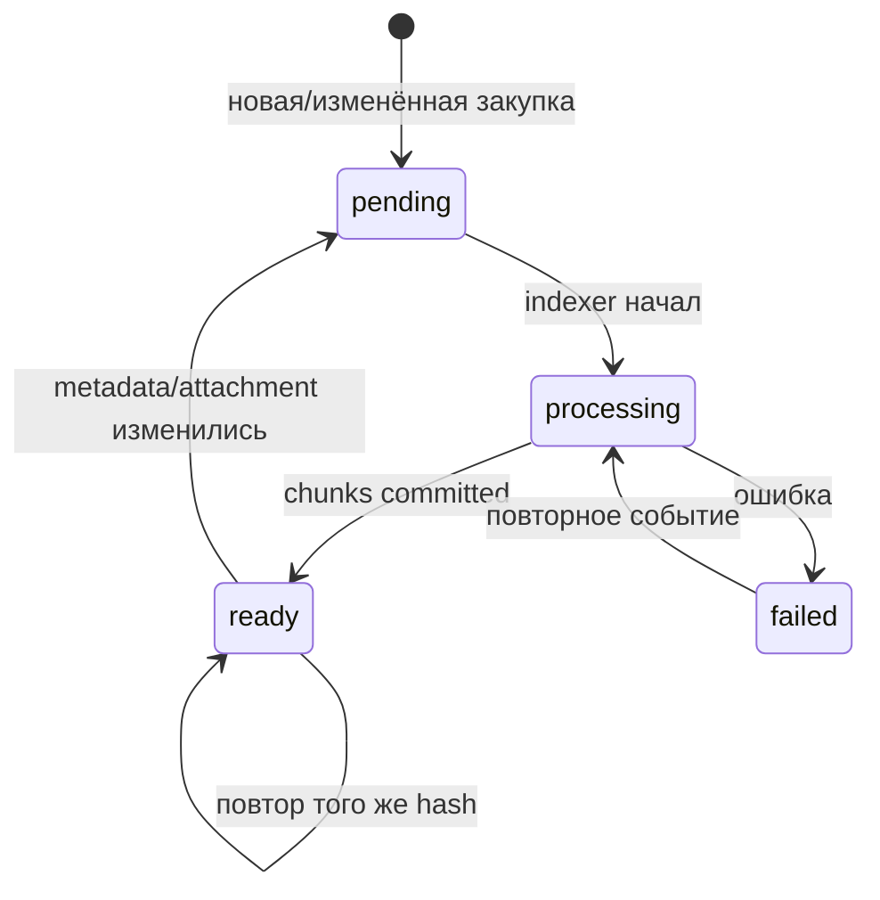
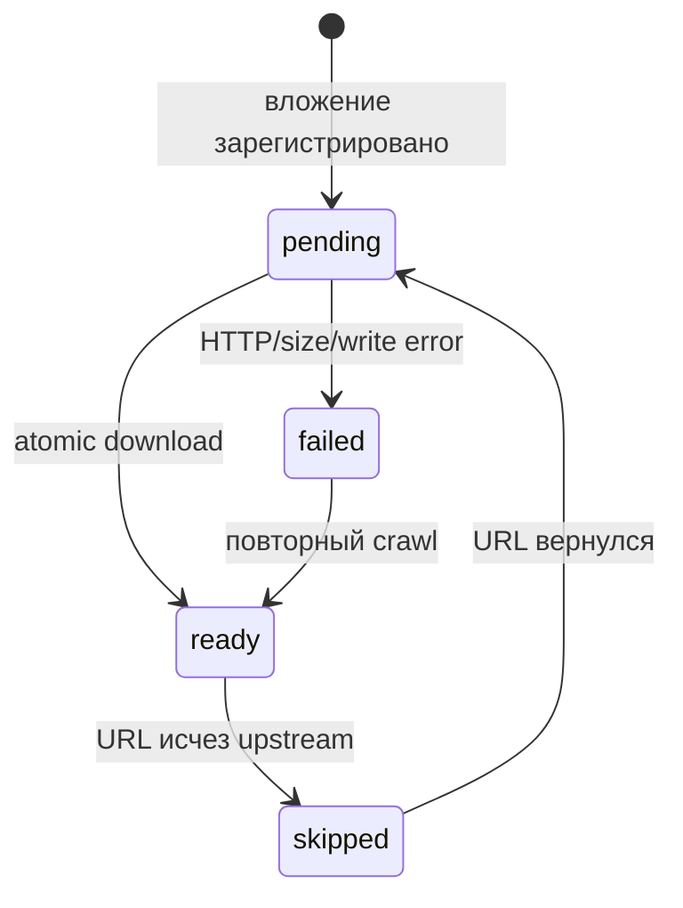

# Данные и контракты

Контракт отвечает на вопрос «какие поля допустимы и что они означают». Pydantic-контракты защищают границы Python, SQL constraints — постоянное состояние, JSON Schema — межпроцессное событие.

## ER-модель



## Таблицы

### `sources`

Одна строка на внешний источник. `cursor` — непрозрачная позиция пагинации: TenderLens не разбирает её смысл, а возвращает API как есть. `last_sync_at` показывает последнюю успешно зафиксированную порцию.

### `tenders`

| Поле | Значение |
|---|---|
| `source_id + external_id` | бизнес-идентичность закупки внутри источника |
| `title`, `description`, `buyer_name` | нормализованные человекочитаемые поля |
| `amount`, `currency` | необязательная стоимость и ISO-подобный трёхбуквенный код |
| `published_at`, `deadline` | UTC timestamps; naive datetime нормализуется в UTC |
| `source_url` | публичная карточка первоисточника |
| `content_hash` | SHA-256 текущих значимых полей и списка вложений |
| `indexed_hash` | hash версии, для которой chunks успешно записаны |
| `index_status` | `pending`, `processing`, `ready` или `failed` |
| `last_error` | диагностическое сообщение последней индексации |
| `raw_payload` | исходный JSON для аудита и будущего remapping |

`content_hash == indexed_hash` вместе с `index_status=ready` означает согласованный поисковый индекс.

### `attachments`

Строка сначала регистрирует удалённый документ (`pending`), затем загрузчик добавляет `local_path`, фактический `size_bytes`, `sha256` и переводит её в `ready`. `failed` сохраняет ошибку для повторного запуска. `skipped` означает, что документ исчез из новой версии upstream metadata.

### `chunks`

Chunk — атом поиска. `attachment_id=NULL` означает метаданные самой закупки. `position` сохраняет порядок, `section` объясняет происхождение, `content_hash` отслеживает текст, `chunk_key` детерминированно объединяет tender/attachment/position/content/model. `embedding` всегда `VECTOR(1024)`.

### `api_keys`

Хранит только `key_hash`, флаг активности и состояние fixed-window limiter. `window_started_at` округлён до начала UTC-минуты, `request_count` меняется под row lock.

SQLAlchemy-описание: [`models.py`](https://github.com/komaroffsergei/tender-lens/blob/main/src/tender_lens/models.py#L1-L211). Фактический DDL: [migration `0001`](https://github.com/komaroffsergei/tender-lens/blob/main/migrations/versions/0001_initial_schema.py#L21-L197).

## Нормализованная закупка `TenderRecordV1`

Оба внешних API должны вернуть один и тот же внутренний тип:

```json
{
  "source": "ted",
  "external_id": "584491-2026",
  "title": "...",
  "description": null,
  "buyer_name": "...",
  "amount": "100000.00",
  "currency": "EUR",
  "published_at": "2026-08-20T00:00:00Z",
  "deadline": null,
  "source_url": "https://...",
  "attachments": [],
  "raw_payload": {}
}
```

`extra="forbid"` не позволяет тихо принять случайное внутреннее поле. Обязательные строки обрезаются и не могут быть пустыми. Отрицательная сумма и неверная currency отклоняются. Реализация: [`TenderRecordV1`](https://github.com/komaroffsergei/tender-lens/blob/main/src/tender_lens/schemas.py#L49-L100).

## Событие `TenderChangedV1`

```json
{
  "schema_version": 1,
  "event_id": "uuid",
  "occurred_at": "2026-08-20T10:00:00Z",
  "tender_id": "uuid",
  "content_hash": "64 lowercase hex"
}
```

Событие содержит ссылку на состояние, а не копию закупки. Indexer всегда перечитывает row из PostgreSQL и сверяет hash. JSON Schema находится в [`schemas/tender-changed-v1.schema.json`](https://github.com/komaroffsergei/tender-lens/blob/main/schemas/tender-changed-v1.schema.json).

## HTTP-контракты

| Model | Endpoint | Главное ограничение |
|---|---|---|
| `SearchRequest` | `POST /api/v1/search` | query 3..1000, limit 1..10 |
| `AskRequest` | `POST /api/v1/ask` | query 3..1000, limit 1..5 |
| `SearchResponse` | Search | query + items |
| `AskResponse` | Ask | answer + использованные sources |
| `TenderDetails` | GET tender | нет raw payload, hash и local path |
| `ErrorResponse` | все ошибки | code, safe message, request_id, optional details |

## Состояния




