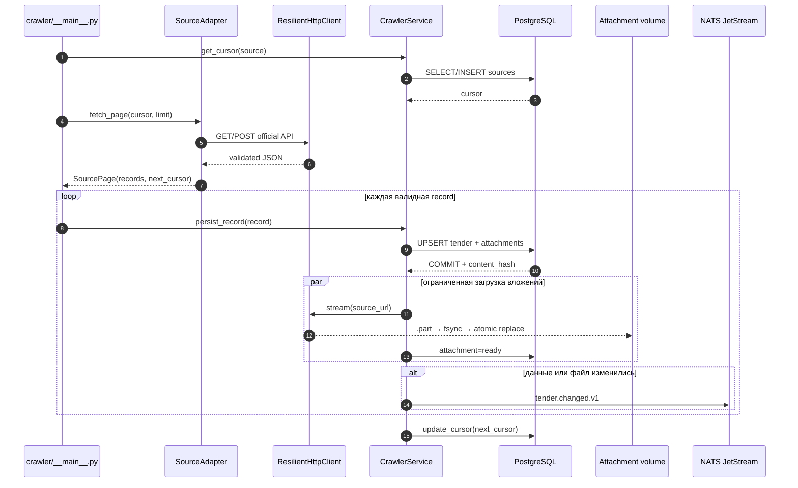
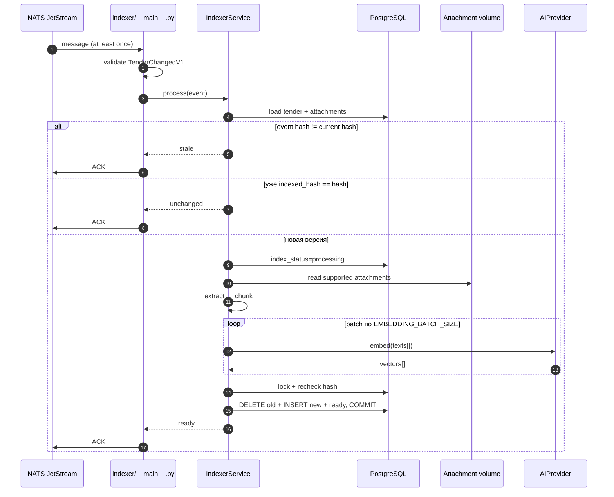
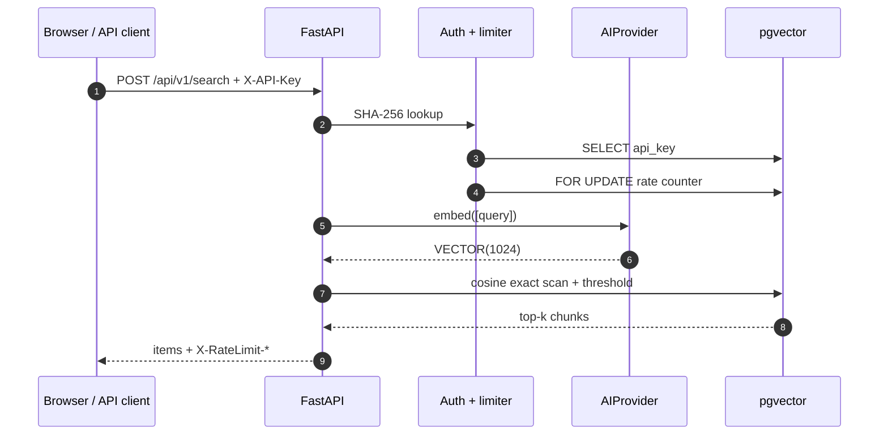
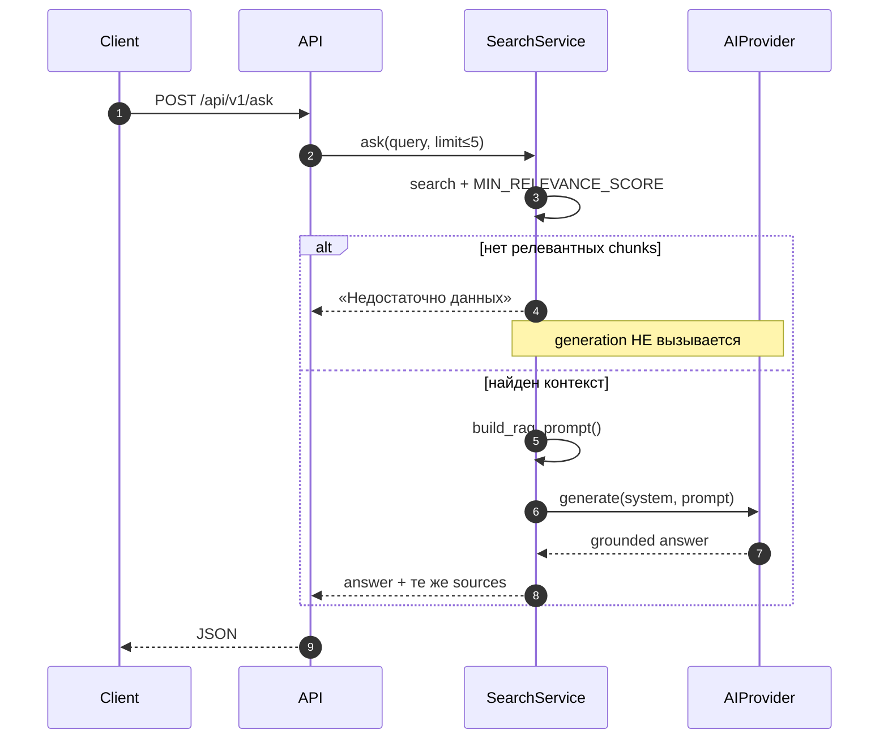

# Потоки данных

Здесь показано не расположение файлов, а порядок действий во времени. Сплошная стрелка — вызов или запись; ответная пунктирная стрелка — результат; блок `alt` — ветвление.

## Crawl одной страницы

Ключевой порядок: **commit данных предшествует publish**, а cursor фиксируется после обработанной порции. Код orchestration — [`run_source()`](https://github.com/komaroffsergei/tender-lens/blob/main/src/tender_lens/crawler/service.py#L256-L297).

### Что считается успехом страницы

- ответ API получен и разобран;
- каждая принятая нормализованная запись зафиксирована;
- сбой отдельного вложения записан в `attachments.error_message`, но не отменяет остальные записи;
- ошибка `persist_record()` прерывает порцию, поэтому cursor не перескакивает потерянную запись;
- publish может временно не выполниться: row остаётся `pending` для следующего `republish_pending()`.

## Индексация события

Повторная проверка hash выполняется после дорогого вызова AI. Поэтому закупка, изменившаяся во время embeddings, не получает индекс от старой версии.

## Search

Search не вызывает generation model. Он выполняет один embedding запроса и SQL из [`SearchService.search()`](https://github.com/komaroffsergei/tender-lens/blob/main/src/tender_lens/search.py#L23-L81).

## Ask / grounded RAG

## Повторы и финальные действия

| Сбой | Следующее действие | Почему нет потери/дубликата |
|---|---|---|
| HTTP timeout/429/5xx | retry с backoff/`Retry-After` | число HTTP-попыток ограничено |
| redirect | перейти без расхода retry | схема и host проверяются заново |
| publish после DB commit | следующий crawl переопубликует `pending` | `content_hash` привязывает event к версии |
| indexer: PostgreSQL/Ollama/OSError | NAK 10 s | JetStream доставит снова, максимум 5 раз |
| event невалиден | TERM | повтор не исправит payload |
| постоянная ошибка кода/extraction | TERM и `failed` | poison message не блокирует очередь |
| worker умер до ACK | redelivery после `ack_wait=300s` | обработка идемпотентна |

`ACK` подтверждает успешную или уже неактуальную обработку. `NAK` просит повторить позже. `TERM` прекращает доставки конкретного сообщения.
