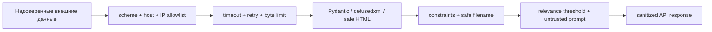

# Безопасность и отказоустойчивость

TenderLens работает с недоверенными URL, JSON, XML, HTML, PDF и prompt-контекстом. Защита построена на нескольких независимых барьерах: один пропущенный check не должен сразу превращаться в SSRF, traversal, prompt injection или утечку секрета.

## Границы доверия



## SSRF и redirect

[`ResilientHttpClient._validate_host()`](https://github.com/komaroffsergei/tender-lens/blob/main/src/tender_lens/crawler/base.py#L72-L87) разрешает только `http/https`, требует host из закрытого allowlist, запрещает localhost, `.local` и неглобальные literal IP. Redirect обрабатывается вручную; каждый новый URL проходит ту же проверку. HTTP retries и redirect count являются разными счётчиками.

!!! warning "Что allowlist не делает"
    Текущая проверка запрещает literal private IP, но не выполняет собственный DNS resolution/pinning. Защита от DNS rebinding остаётся ограничением MVP; production-развёртывание должно дополняться egress firewall/proxy.

## Файловая система

[`safe_filename()`](https://github.com/komaroffsergei/tender-lens/blob/main/src/tender_lens/storage.py#L26-L38) удаляет null byte, path components и опасные символы. Фактический путь включает UUID tender и attachment. Загрузка:

1. предварительно проверяет `Content-Length`, если он есть;
2. считает реальные байты независимо от заголовка;
3. пишет в уникальный `.part`;
4. одновременно вычисляет SHA-256;
5. вызывает `flush` и `fsync`;
6. заменяет target через `os.replace`;
7. удаляет временный файл при любой ошибке.

## Парсинг документов

- XML проходит через [`defusedxml`](https://github.com/tiran/defusedxml), чтобы отключить опасные сущности.
- HTML-парсер отбрасывает `script`, `style`, `noscript` и извлекает только текст.
- JSON декодируется как UTF-8 и повторно сериализуется в стабильный читаемый вид.
- PDF обрабатывается `pypdf`; OCR и active content не исполняются.
- неизвестный binary остаётся сохранённым, но не индексируется.

## Prompt injection

[`build_rag_prompt()`](https://github.com/komaroffsergei/tender-lens/blob/main/src/tender_lens/ai.py#L134-L157) помещает найденный текст в секцию «КОНТЕКСТ» и системно объявляет документы недоверенными данными, а не инструкциями. Это уменьшает риск, но не является математической гарантией поведения модели. API также:

- не вызывает generation без результатов выше `MIN_RELEVANCE_SCORE`;
- передаёт максимум пять chunks;
- просит не добавлять факты из памяти;
- возвращает ровно использованные sources для проверки.

## API-ключи и rate limit

```text
tl_open_secret → SHA-256 → api_keys.key_hash
```

Открытое значение показывается один раз. `X-API-Key` не попадает в структурированный лог: [`mask_mapping()`](https://github.com/komaroffsergei/tender-lens/blob/main/src/tender_lens/logging.py#L14-L25) маскирует известные secret-поля. Limiter использует PostgreSQL row lock, поэтому несколько API workers не расходуют один слот одновременно.

## Событийная устойчивость

JetStream даёт семантику **at least once**, поэтому duplicate delivery считается нормой. Защита:

- `Nats-Msg-Id=event_id` включает broker deduplication window;
- `indexed_hash` делает повторную обработку дешёвой;
- hash проверяется до и после AI;
- `ACK` выполняется только после DB commit;
- временные ошибки получают `NAK`, постоянные — `TERM`;
- `ack_wait=300s`, `max_deliver=5` ограничивают зависшие/ядовитые события.

## Ошибки наружу и внутрь

Внешний клиент получает стабильный `ErrorResponse` с `request_id`, но без DSN, stack trace, local path или hash. Полный exception остаётся в JSON log и связывается по `request_id`, `event_id`, `tender_id` или `source`.

## Production-gap checklist

- TLS termination и secret manager вместо локального `.env`;
- egress policy/DNS pinning для crawler;
- malware scanning вложений;
- OCR sandbox для image-only PDF;
- rotation и аудит API-ключей;
- метрики, tracing и alerting;
- dead-letter review после `max_deliver`;
- HNSW/IVFFlat и нагрузочное тестирование при росте chunks.

Политика disclosure и supported versions находятся в [`SECURITY.md`](https://github.com/komaroffsergei/tender-lens/blob/main/SECURITY.md).
