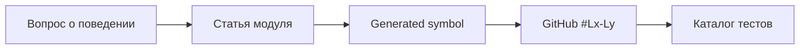

# Как пользоваться картой кода

Reference-раздел — навигационный индекс, а не замена архитектурных объяснений. Он генерируется из текущего репозитория и поэтому отвечает на вопрос «какой файл/символ существует сейчас и где он реализован?».

## Четыре представления

| Страница | Содержимое | Когда открывать |
|---|---|---|
| [Дерево репозитория](reference/repository-tree.md) | каждый tracked-файл, назначение и GitHub link | незнакомая папка или filename |
| [Python API](reference/python-api.md) | module → class → method/function, signature, lines | ищете реализацию поведения |
| [Frontend API](reference/frontend-api.md) | DOM ids/sections, JS functions, CSS selectors | меняете UI без framework |
| [Каталог тестов](reference/test-catalog.md) | test file → test case → уровень | ищете доказательство требования |

## Направление чтения



Например, вопрос «почему старое событие безопасно?»:

1. [Indexer → Version-safe process](modules/indexer.md#version-safe-process);
2. [`IndexerService.process()` в Python API](reference/python-api.md);
3. [реализация на GitHub](https://github.com/komaroffsergei/tender-lens/blob/main/src/tender_lens/indexer/service.py#L70-L151);
4. поиск `stale_event` в [каталоге тестов](reference/test-catalog.md).

## Что считается файлом

Генератор читает `git ls-files`, то есть показывает только version-controlled content. Не попадают `.env`, `.venv`, Docker volumes, downloaded attachments, generated `site/` и IDE settings. Это отделяет архитектуру проекта от локального мусора.

## Что извлекается автоматически

- Python module docstring, imports, classes, methods, sync/async functions и decorators;
- JS named functions;
- HTML `id`, section и form controls;
- CSS selectors;
- test cases и pytest markers;
- file line count, byte size и прямой URL GitHub.

Описание файла берётся из явной project taxonomy, module docstring или безопасного fallback. Сгенерированные страницы нельзя править вручную.

## Обновление

```powershell
python scripts/generate_code_reference.py
python scripts/generate_code_reference.py --check
python -m mkdocs build --strict
python scripts/check_docs.py
```

`--check` ничего не пишет и завершается ошибкой при drift. Тот же порядок выполняет GitHub Actions.
