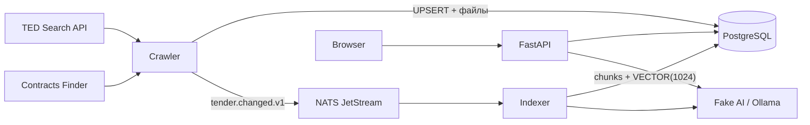

---
search:
  boost: 2
---

Асинхронный сбор · событийная индексация · локальный RAG

# Как устроен TenderLens

TenderLens получает открытые закупки из TED и Contracts Finder, безопасно скачивает документы, сохраняет данные в PostgreSQL, асинхронно строит векторный индекс и отвечает на вопросы только по найденным фрагментам.

  
<strong>3 роли</strong>crawler · indexer · API

  
<strong>2 источника</strong>TED · Contracts Finder

  
<strong>1 событие</strong>tender.changed.v1

  
<strong>1024</strong>размерность embedding

## Система в одной схеме

Это не десять независимых учебных приложений. Основная работа — **задание №7: асинхронный crawler**. Search/RAG, rate limiter, Docker Compose и CI — бонусные расширения, которые показывают полный жизненный цикл собранных данных.

## Путь одной закупки

  
<strong>1 · Получение.</strong> Адаптер забирает страницу внешнего API и превращает разные JSON-форматы в единый <a href="https://github.com/komaroffsergei/tender-lens/blob/main/src/tender_lens/schemas.py#L49-L100"><code>TenderRecordV1</code></a>.

  
<strong>2 · Фиксация.</strong> <a href="https://github.com/komaroffsergei/tender-lens/blob/main/src/tender_lens/crawler/service.py#L77-L162"><code>CrawlerService.persist_record()</code></a> делает идемпотентный UPSERT и регистрирует вложения.

  
<strong>3 · Доставка.</strong> После commit crawler публикует <a href="https://github.com/komaroffsergei/tender-lens/blob/main/src/tender_lens/schemas.py#L102-L117"><code>TenderChangedV1</code></a> в durable-очередь NATS JetStream.

  
<strong>4 · Индексация.</strong> <a href="https://github.com/komaroffsergei/tender-lens/blob/main/src/tender_lens/indexer/service.py#L70-L151"><code>IndexerService.process()</code></a> извлекает текст, создаёт chunks и атомарно заменяет индекс.

  
<strong>5 · Ответ.</strong> <a href="https://github.com/komaroffsergei/tender-lens/blob/main/src/tender_lens/search.py#L23-L93"><code>SearchService</code></a> ищет по cosine similarity; `/ask` вызывает Ollama только при наличии релевантного контекста.

## С чего начать

| Если нужно… | Откройте | Результат |
|---|---|---|
| запустить проект | [Первые 10 минут](getting-started.md) | работающий Compose, ключ и первый запрос |
| понять границы процессов | [Обзор архитектуры](architecture.md) | роли, хранилища и зависимости |
| проследить один сценарий | [Потоки данных](architecture/runtime-flows.md) | sequence-схемы crawl, index и ask |
| найти реализацию | [Дерево репозитория](reference/repository-tree.md) | назначение каждого tracked-файла |
| найти класс или функцию | [Python API](reference/python-api.md) | сигнатура, диапазон строк и GitHub-ссылка |
| разобраться в термине | [Глоссарий](glossary.md) | определения с привязкой к TenderLens |
| проверить всё вручную | [Запуск и реальная LLM](operations.md) | пошаговый acceptance-сценарий |
| понять качество | [Тестирование](testing.md) | unit → API → integration → E2E |

## Что система гарантирует

- одна и та же закупка не размножается при повторном crawl;
- cursor источника продвигается только после обработанной порции;
- redirect проверяется на каждом переходе, private/local IP запрещены;
- вложение пишется потоково во временный файл, ограничивается по размеру и получает SHA-256;
- старое событие не может перезаписать новую версию закупки;
- низкорелевантный вопрос не вызывает генеративную модель;
- открытый API-ключ не хранится в базе.

Ограничения перечислены рядом с решениями в [компромиссах](tradeoffs.md), а доказательства требований — в [traceability](traceability.md).

Основная ветка: <code>main</code> · публичный репозиторий: <a href="https://github.com/komaroffsergei/tender-lens">komaroffsergei/tender-lens</a>

