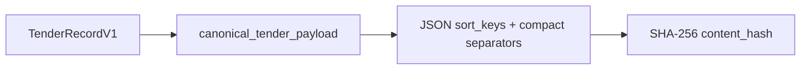

# Конфигурация и домен

Эти модули не запускают роли сами. Они определяют язык системы: настройки, валидные структуры, persistence-модели, hashes, ошибки и логи.

<dl class="module-contract">
  <dt>Вход</dt><dd>environment variables, внешние payloads, значения домена</dd>
  <dt>Выход</dt><dd>типизированные Settings/Pydantic models/SQLAlchemy models</dd>
  <dt>Побочные эффекты</dt><dd>нет при импорте; DB connection создаётся только явной функцией</dd>
  <dt>Потребители</dt><dd>crawler, indexer, API, CLI, migrations и tests</dd>
</dl>

## `config.py` — единая конфигурация

[`Settings`](https://github.com/komaroffsergei/tender-lens/blob/main/src/tender_lens/config.py#L13-L79) наследует `BaseSettings`: имя поля `database_url` автоматически соответствует `DATABASE_URL`. `.env` читается как дополнительный источник, лишние переменные игнорируются, а ограничения проверяются до создания соединений.

Группы полей:

- **runtime:** `app_env`, `log_level`;
- **dependencies:** `database_url`, `nats_url`, `ollama_url`;
- **AI:** режим, модели, размерность, batch, threshold и timeout;
- **crawler:** директория, лимит байт, concurrency, retry/delay;
- **sources:** base URL, query/page size, Contracts Finder cooldown;
- **NATS:** stream, subject, consumer, ACK policy.

`embedding_dimensions` имеет тип `int`, чтобы принять строку `"1024"` из environment, и отдельный validator запрещает любое значение кроме 1024 — оно зафиксировано DDL `VECTOR(1024)`. [`get_settings()`](https://github.com/komaroffsergei/tender-lens/blob/main/src/tender_lens/config.py#L82-L86) кэширует один объект на процесс.

## `schemas.py` — boundary-контракты

| Тип | Где появляется | Ответственность |
|---|---|---|
| `AttachmentRecordV1` | adapters → crawler | нормализованная ссылка на вложение |
| `TenderRecordV1` | adapters → crawler | единая закупка независимо от источника |
| `TenderChangedV1` | crawler → NATS → indexer | ссылка на конкретную версию tender |
| `SearchRequest`, `AskRequest` | HTTP input | query и разные пределы top-k |
| `SearchResult/Response` | retrieval output | безопасный fragment без internal fields |
| `TenderDetails` | detail endpoint | карточка и публичные attachment metadata |
| `ErrorResponse` | exception handlers | стабильная ошибка и correlation id |

Pydantic нужен на границе, где данные ещё не заслуживают доверия. Внутри SQLAlchemy row уже защищён DDL и сервисными инвариантами.

## `models.py` и `db.py` — persistence

[`models.py`](https://github.com/komaroffsergei/tender-lens/blob/main/src/tender_lens/models.py) объявляет ровно пять application tables. Relationships помогают загрузить source/attachments/chunks, но таблицы создаёт Alembic, а не `metadata.create_all`.

[`create_engine()`](https://github.com/komaroffsergei/tender-lens/blob/main/src/tender_lens/db.py#L20-L26) включает `pool_pre_ping` и recycle. [`create_session_factory()`](https://github.com/komaroffsergei/tender-lens/blob/main/src/tender_lens/db.py#L28-L30) создаёт независимые async sessions с `expire_on_commit=False`. [`session_scope()`](https://github.com/komaroffsergei/tender-lens/blob/main/src/tender_lens/db.py#L33-L40) показывает общий commit/rollback pattern, хотя сервисы часто управляют транзакцией явно.

## `hashing.py` — идентичность версии

[`canonical_tender_payload()`](https://github.com/komaroffsergei/tender-lens/blob/main/src/tender_lens/hashing.py#L38-L62) включает значимые нормализованные поля и сортирует attachments. Timestamps обработки, DB UUID и index status в hash не входят. [`build_chunk_key()`](https://github.com/komaroffsergei/tender-lens/blob/main/src/tender_lens/hashing.py#L78-L87) делает стабильный ключ из tender, attachment, позиции, hash текста и embedding model.

## `errors.py` — контролируемые отказы

`AppError` несёт машинный `code`, безопасный `message`, HTTP status и optional details. Специализации отделяют unavailable dependency, source HTTP, attachment, extraction и неверный AI response. FastAPI переводит их в один `ErrorResponse`; worker использует тип ошибки, чтобы выбрать `NAK` или `TERM`.

## `logging.py` — наблюдаемость без секретов

[`JsonFormatter`](https://github.com/komaroffsergei/tender-lens/blob/main/src/tender_lens/logging.py#L28-L41) пишет UTC timestamp, level, logger, message и доступные correlation fields. [`mask_mapping()`](https://github.com/komaroffsergei/tender-lens/blob/main/src/tender_lens/logging.py#L14-L25) рекурсивно скрывает API keys, authorization, password и key hash.

## Правило зависимостей

Core может знать о Pydantic/SQLAlchemy, но не импортирует entrypoints. `schemas.py` не зависит от `models.py`; адаптеры возвращают schema, сервис преобразует её в model. Это предотвращает смешивание внешнего контракта и структуры БД.
