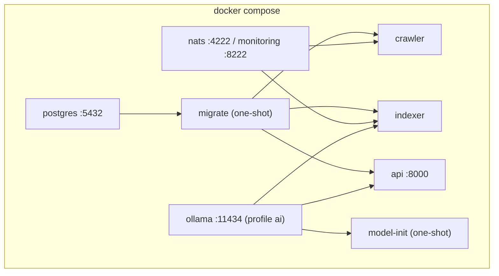

# Инфраструктура

Infrastructure-код соединяет процессы с PostgreSQL, NATS, файловым volume, Docker и CI. Он не определяет бизнес-формат внешней закупки.

## Compose topology



[`docker-compose.yml`](https://github.com/komaroffsergei/tender-lens/blob/main/docker-compose.yml) использует YAML anchor `x-app`, чтобы crawler/indexer/API/migrate собирались из одного Dockerfile и получали один env/attachment volume. `depends_on.condition` задаёт readiness ordering, но не заменяет retry внутри приложения.

## Docker image

[`Dockerfile`](https://github.com/komaroffsergei/tender-lens/blob/main/Dockerfile) основан на `python:3.12-slim`, устанавливает pinned runtime dependencies, package и migration assets. Runtime user `app` с UID 10001 не root. Один image поддерживает разные commands, поэтому build и dependency set одинаковы для всех ролей.

## PostgreSQL и migration

[`migrations/env.py`](https://github.com/komaroffsergei/tender-lens/blob/main/migrations/env.py) преобразует async application URL в Alembic workflow. [`0001_initial_schema.py`](https://github.com/komaroffsergei/tender-lens/blob/main/migrations/versions/0001_initial_schema.py) создаёт extension `vector`, пять таблиц, FK, unique/check constraints и B-tree indexes. Downgrade удаляет объекты в обратном dependency order.

Application не запускает migration автоматически при import. Compose one-shot `migrate` выполняет `alembic upgrade head` до старта ролей.

## NATS JetStream

[`NatsBroker`](https://github.com/komaroffsergei/tender-lens/blob/main/src/tender_lens/nats.py#L34-L146) скрывает библиотеку `nats-py` за узким API:

- `connect()` — connection + stream ensure;
- `ensure_stream()` — создаёт file-backed stream или проверяет subject существующего;
- `publish_tender_changed()` — JSON bytes + idempotency header;
- `iter_messages()` — durable pull consumer;
- `close()` — drain и close.

[`NatsMessage`](https://github.com/komaroffsergei/tender-lens/blob/main/src/tender_lens/nats.py#L14-L31) не даёт indexer зависеть от типов SDK; ему доступны только bytes, ACK, NAK и TERM. `InMemoryBroker` используется в детерминированном E2E без внешнего NATS, а integration test проверяет настоящий JetStream.

## Attachment volume

`attachments_data` монтируется в `/data/attachments` crawler и indexer. БД хранит `local_path`, но API никогда не возвращает его. Структура:

```text
/data/attachments/
└── {tender_uuid}/
    └── {attachment_uuid}_{safe_filename}
```

В development это Docker named volume; production может заменить его object storage adapter, не меняя внешний tender contract.

## Lockfiles

| Файл | Содержимое |
|---|---|
| `requirements.lock` | runtime dependencies image |
| `requirements-dev.lock` | runtime + format/lint/type/test |
| `requirements-docs.lock` | Material for MkDocs и transitive docs stack |
| `pyproject.toml` | package metadata и tool configuration |

Pinned версии делают CI и локальную сборку воспроизводимыми. Обновление lockfile должно идти отдельным commit с полным test run.

## CI/CD

`ci.yml` проверяет качество, integration/E2E и image smoke. `docs.yml` генерирует/проверяет карту кода, собирает сайт strict-режимом и публикует artifact GitHub Pages только из `main`.
