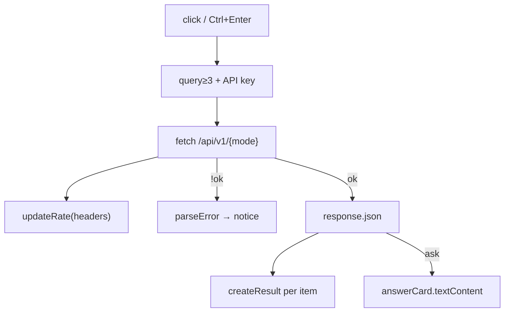

# Web UI

UI — статический progressive enhancement слой без framework, bundler, CDN и внешних runtime-зависимостей. FastAPI отдаёт три packaged files.

<dl class="module-contract">
  <dt>Вход</dt><dd>API key и текст пользователя</dd>
  <dt>Выход</dt><dd>Search/Ask request, безопасно созданные DOM nodes</dd>
  <dt>Хранение</dt><dd>API key только в sessionStorage текущей вкладки</dd>
  <dt>Файлы</dt><dd>index.html · app.js · styles.css</dd>
</dl>

## DOM-структура

```text
body
├── header.topbar
│   ├── a.brand
│   └── #health.status-pill
├── main.layout
│   ├── section.hero
│   ├── section.workspace
│   │   ├── .search-panel (key, query, mode, submit)
│   │   └── .side-panel (объяснение + rate state)
│   ├── #notice
│   ├── #answer-card
│   └── .results-section
│       └── #results
└── footer
```

HTML: [`web/index.html`](https://github.com/komaroffsergei/tender-lens/blob/main/src/tender_lens/web/index.html).

## JavaScript flow



[`createResult()`](https://github.com/komaroffsergei/tender-lens/blob/main/src/tender_lens/web/app.js#L29-L66) использует `createElement` и `textContent`, а не `innerHTML`: текст внешнего документа не интерпретируется как markup. Source link получает `target=_blank` вместе с `rel="noopener noreferrer"`.

[`submitQuery()`](https://github.com/komaroffsergei/tender-lens/blob/main/src/tender_lens/web/app.js#L96-L149) управляет loading state через `disabled`/`aria-busy`, очищает старый результат, различает items/sources и всегда восстанавливает кнопку в `finally`.

## API key

Кнопка «Сохранить в сессии» пишет `tenderLensApiKey` в `sessionStorage`. Это удобство, а не secret vault: любой JavaScript той же origin мог бы прочитать значение. Поэтому UI не подключает remote scripts, а production должен использовать строгий CSP и TLS.

## Accessibility

- semantic `header/main/section/aside/footer`;
- связанные `label` и form controls;
- `aria-live` для health/notice;
- hidden heading для workspace landmark;
- keyboard shortcut ++ctrl+enter++;
- focus styles и responsive stacking;
- цвет не является единственным носителем статуса: рядом есть текст.

## CSS

[`styles.css`](https://github.com/komaroffsergei/tender-lens/blob/main/src/tender_lens/web/styles.css) определяет tokens в `:root`, двухколоночный workspace, компактные result rows и breakpoints `850px/560px`. В UI нет скрытого build step: изменение CSS/JS сразу попадает в image через package data.

## Почему не React

Текущий экран имеет одно состояние запроса и небольшой объём DOM. Framework добавил бы Node toolchain, bundle и dependency surface без пропорциональной пользы. При появлении routing, сложных filters, pagination и shared components решение стоит пересмотреть.

Полный generated-список DOM anchors, JS functions и CSS selectors — [Frontend API](../reference/frontend-api.md).
