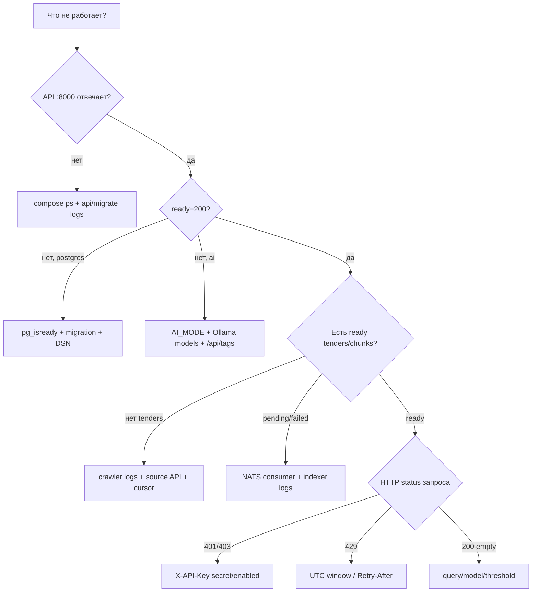

# Диагностика

Начинайте с симптома и проверяйте слои слева направо. Не удаляйте volumes до фиксации logs и состояния БД — иначе исчезнет причина.

## Универсальный снимок

```powershell
docker compose --profile ai ps
docker compose --profile ai logs --tail 100 postgres nats migrate crawler indexer api ollama model-init
Invoke-WebRequest http://localhost:8000/health/live -UseBasicParsing
Invoke-WebRequest http://localhost:8000/health/ready -UseBasicParsing
```

## Дерево решений



## `.env` не принимается

```powershell
docker compose config --quiet
docker compose run --rm api python -c "from tender_lens.config import Settings; print(Settings())"
```

Частые причины:

- `.env` отсутствует рядом с `docker-compose.yml`;
- `EMBEDDING_DIMENSIONS` не 1024;
- число записано с лишним текстом;
- URL не соответствует ожидаемому runtime hostname (`postgres`, `nats`, `ollama` внутри Compose, `localhost` с host).

`.env.example` проверяется отдельным unit test; если его чистая копия не загружается, это regression.

## `api` не стартует

1. Проверьте `migrate` — он должен `Exited (0)`.
2. Проверьте port collision: `Get-NetTCPConnection -LocalPort 8000`.
3. Посмотрите первую exception в `docker compose logs api`, а не только последнюю restart line.
4. Проверьте, что image содержит `src/tender_lens/web/index.html`.

## `ready.ai=false`

### Fake

`AI_MODE=fake` не требует Ollama. Если readiness false, убедитесь, что Compose environment действительно передал fake:

```powershell
docker compose exec api python -c "from tender_lens.config import get_settings; print(get_settings().ai_mode)"
```

### Live

```powershell
docker compose exec ollama ollama list
docker compose logs --tail 100 model-init ollama
docker compose exec api python -c "import urllib.request; print(urllib.request.urlopen('http://ollama:11434/api/tags').status)"
```

Если model-init ещё скачивает model, readiness временно 503 — это правильно. После загрузки перезапустите indexer/API, если они были запущены до Ollama и находятся в старом crash loop.

## Crawler получает 403/429/5xx

- 429/5xx ретраятся с `Retry-After`/backoff;
- Contracts Finder 403 может быть временным и получает отдельный cooldown;
- TED 403 не считается обычным временным response;
- после `HTTP_MAX_ATTEMPTS` source cycle завершается ошибкой, второй source всё равно запускается.

Не уменьшайте delay и не добавляйте произвольный host в allowlist только для «прохождения». Сначала подтвердите официальный endpoint/attachment link.

## `Host не разрешён политикой crawler`

Это security decision, а не network bug. Сравните hostname URL с [`_source_hosts()`](https://github.com/komaroffsergei/tender-lens/blob/main/src/tender_lens/crawler/__main__.py#L42-L52). Добавлять host можно только если он:

1. присутствует в живом payload официального API;
2. принадлежит официальному владельцу/поставщику документов;
3. покрыт unit test;
4. не расширяет правило до wildcard/произвольного external host.

## Tender есть, но `pending`

```powershell
docker compose logs --tail 100 crawler indexer nats
Invoke-RestMethod http://localhost:8222/jsz?streams=true&consumers=true
```

Возможности:

- publish не прошёл — следующий crawler cycle вызовет `republish_pending`;
- NATS consumer отсутствует — indexer не подключился;
- сообщение ack-pending — indexer ещё работает или завис;
- model недоступна — временная ошибка получает NAK.

## Tender `failed`

```powershell
docker compose exec postgres psql -U tender_lens -d tender_lens -c `
  "SELECT id, external_id, left(last_error, 300) FROM tenders WHERE index_status='failed' ORDER BY updated_at DESC LIMIT 20;"
```

Исправьте первопричину и повторно опубликуйте pending/failed запись через новый crawl/изменение. Для одноразовой диагностики не меняйте status напрямую: ручная SQL-правка обходит сервисные инварианты.

## Search пуст при ready data

Проверьте:

```powershell
docker compose exec postgres psql -U tender_lens -d tender_lens -c "SELECT count(*) FROM chunks;"
docker compose exec api python -c "from tender_lens.config import get_settings; print(get_settings().min_relevance_score, get_settings().embedding_model)"
```

Причины: query не связан с corpus, threshold слишком высок, индекс построен другой embedding model/режимом или живые документы не содержат ожидаемого текста. После смены embedding model нужна полная reindex, а не смешивание vectors.

## Ask отвечает «Недостаточно данных»

Это не ошибка, если `sources=[]`. Такой ответ означает, что retrieval threshold защитил модель от выдумывания. Сначала выполните `/search` тем же query и изучите corpus/score.

## 401/403 и «что за ключ»

- `401 api_key_required` — header отсутствует;
- `401 api_key_invalid` — передан не secret `tl_…`, key не найден;
- `403 api_key_disabled` — key создан, но отключён.

Создайте новый secret через CLI. Нельзя извлечь старый открытый key из DB: хранится только необратимый SHA-256 hash.

## Integration test и event loop

Integration fixtures создают/закрывают async engine внутри loop конкретного test. Если появляется `Future attached to a different loop`, проверьте, что engine/session factory не стали session-scoped globals и что `pytest-asyncio` config не переопределён локально.

## Документация не собирается

```powershell
python scripts/generate_code_reference.py
python -m mkdocs build --strict
python scripts/check_docs.py
```

- `reference drift` — generator изменил output; commit-ните его;
- missing nav file — путь в `mkdocs.yml` не существует;
- invalid source link — диапазон строк вышел за файл;
- Mermaid syntax — проверьте diagram block и quotes в labels.
