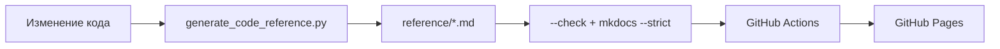

# Как читать документацию

Документация устроена в три слоя. Сначала прочитайте короткую обзорную статью, затем страницу конкретного модуля, а к сгенерированной карте обращайтесь за точной сигнатурой и строкой реализации.

## Три уровня подробности

1. **Объяснение.** Страницы «Архитектура» и «Модули» отвечают на вопросы «зачем?» и «как компоненты связаны?».
2. **Навигация.** [Дерево репозитория](reference/repository-tree.md) отвечает «где это лежит?» и описывает каждый tracked-файл.
3. **Доказательство.** [Python API](reference/python-api.md) и [Frontend API](reference/frontend-api.md) ведут на точные диапазоны строк GitHub.

## Поиск

Нажмите :material-magnify: в заголовке или ++ctrl+k++. Индекс строится во время `mkdocs build` и включает:

- заголовки и полный текст статей;
- имена файлов, классов, функций и методов;
- сигнатуры и docstrings;
- названия тестов;
- русский и английский технический словарь.

Поиск выполняется в браузере и не отправляет запрос стороннему сервису.

## Как читать ссылку на код

В статье встречаются ссылки вида [`CrawlerService.run_source()`](https://github.com/komaroffsergei/tender-lens/blob/main/src/tender_lens/crawler/service.py#L256-L297). Они указывают на ветку `main` и конкретный диапазон строк. Рядом в reference-страницах показаны:

- полная сигнатура;
- модуль и родительский класс;
- короткая ответственность;
- начало и конец определения;
- прямая ссылка «исходник».

Сгенерированные страницы имеют предупреждение `AUTO-GENERATED`. Их нельзя редактировать вручную: источник — AST и tracked-файлы репозитория.

## Обозначения

| Обозначение | Значение |
|---|---|
| `роль` | отдельный долгоживущий процесс Compose |
| `модуль` | Python-файл, импортируемый по dotted path |
| `контракт` | структура данных и правила её валидации |
| `событие` | неизменяемое сообщение о произошедшем факте |
| `chunk` | фрагмент текста, являющийся единицей поиска |
| `source link` | GitHub URL с `#Lx-Ly` |

Все термины раскрыты в [глоссарии](glossary.md).

## Как документация остаётся актуальной

CI отклоняет изменение, если карта кода не перегенерирована, внутренняя ссылка сломана, source-link указывает за пределы файла или документационный сайт не собирается в strict-режиме.
