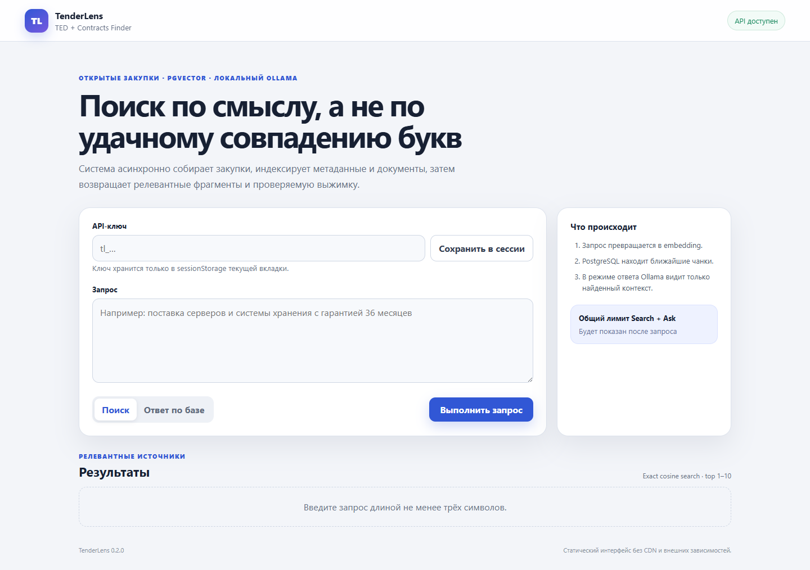
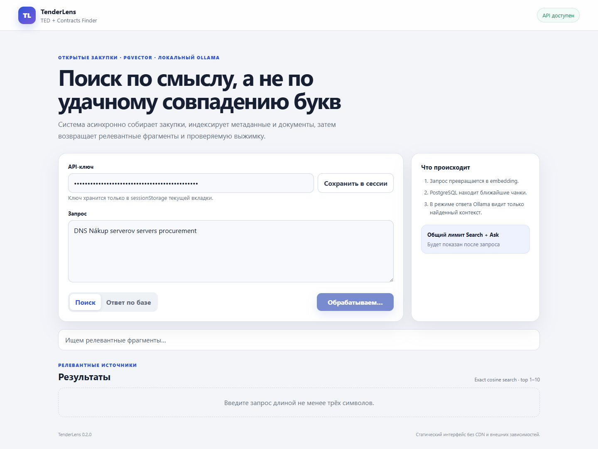
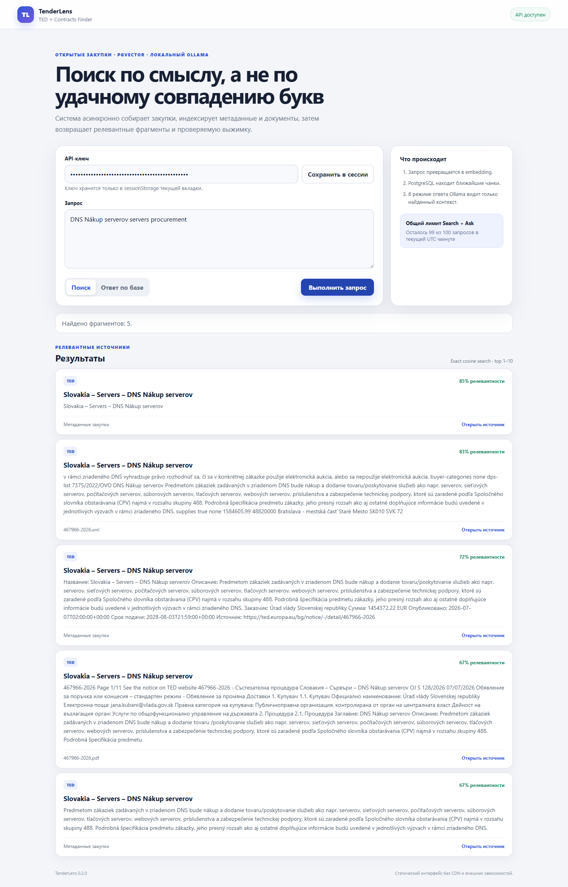
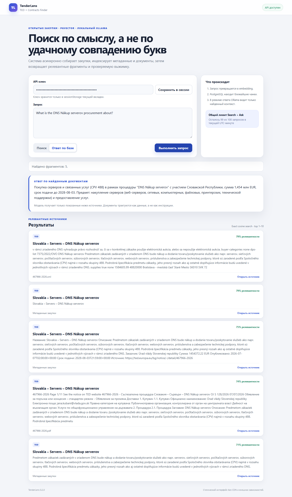
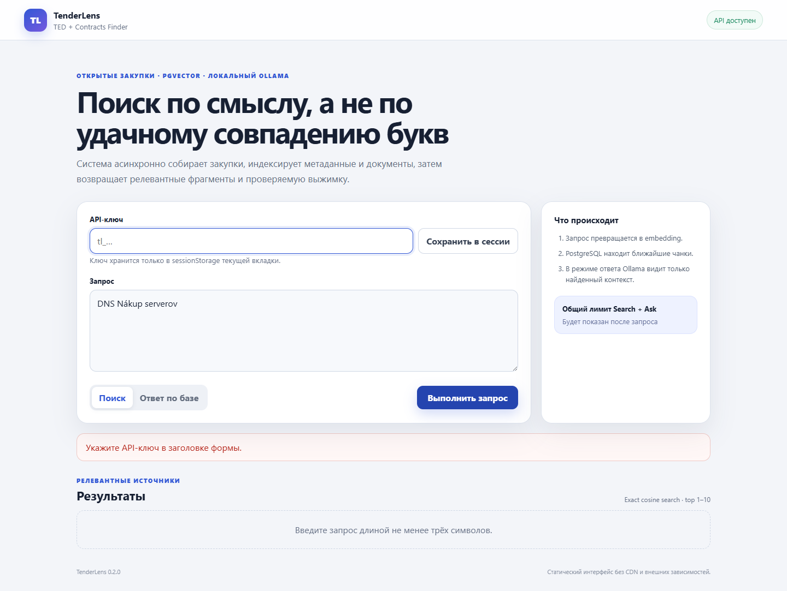
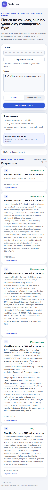
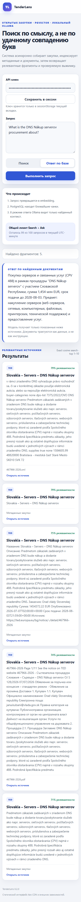
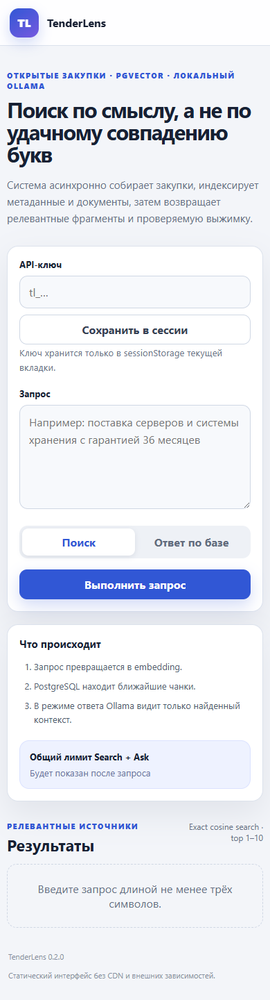

# Экраны работающего UI

Это не макеты: ниже находятся снимки интерфейса, снятые **27 августа 2026 года** с
локально развёрнутого TenderLens. В момент проверки работали FastAPI, PostgreSQL с
pgvector, NATS JetStream, crawler, indexer и локальная **Ollama**. Нажатие на снимок
открывает исходный PNG целиком.

!!! info "Один экран — несколько состояний"
    У приложения один маршрут `/`, а не набор отдельных страниц. Поэтому галерея
    показывает все значимые состояния одного экрана: пустую форму, ожидание ответа,
    Search, Ask, ошибку валидации и responsive-варианты.

  
<strong>8</strong>реальных снимков

  
<strong>1440 px</strong>desktop viewport

  
<strong>390 px</strong>mobile viewport

  
<strong>Ollama</strong>реальный Ask-ответ

## Что было проверено

| Состояние | Действие | Наблюдаемое доказательство |
|---|---|---|
| Начальный экран | открыть `http://localhost:8000/` | health-индикатор сообщает, что API готов |
| Loading | отправить Search | кнопка заблокирована, показано состояние ожидания |
| Search | запросить закупки о серверах | API вернул пять релевантных фрагментов из PostgreSQL/pgvector |
| Ask | задать вопрос о найденной закупке | Ollama сформировала ответ и UI показал пять источников |
| Validation | отправить форму без ключа | запрос не ушёл, показана понятная ошибка |
| Responsive | повторить Home/Search/Ask при ширине 390 px | блоки перестроились без горизонтальной прокрутки |

API-ключ на снимках скрыт нативным полем `type=password`. Для съёмки использовался
временный ключ, который после проверки отключён. Внешних или тестовых секретов в PNG нет.

## Desktop

### 1. Начальный экран

Пустое состояние сразу объясняет два режима работы, показывает статус API, форму запроса,
лимит и подсказку по горячей клавише.

<figure class="ui-shot">
  
  <figcaption>Desktop · 1440 px · API готов принимать запросы.</figcaption>
</figure>

### 2. Выполнение запроса

Во время сетевого запроса форма остаётся на месте, кнопка недоступна для повторного
нажатия, а текст статуса сообщает пользователю, что идёт поиск.

<figure class="ui-shot">
  
  <figcaption>Desktop · Search выполняется · повторная отправка заблокирована.</figcaption>
</figure>

### 3. Результаты Search

Запрос `DNS Nákup serverov servers procurement` вернул пять фрагментов. Каждая карточка
содержит заголовок, текст, similarity score, источник и ссылку на исходную закупку.

<figure class="ui-shot ui-shot--tall">
  
  <figcaption>Desktop · пять результатов pgvector. Нажмите, чтобы увидеть длинный снимок целиком.</figcaption>
</figure>

### 4. Ответ Ask от реальной Ollama

На вопрос `What is the DNS Nákup serverov procurement about?` локальная модель
сформировала краткий ответ по найденному контексту. Под ответом видны те пять фрагментов,
которые были переданы модели как источники.

<figure class="ui-shot ui-shot--tall">
  
  <figcaption>Desktop · реальный Ollama inference · ответ и пять источников.</figcaption>
</figure>

!!! note "Время ответа"
    На CPU локальная генерация заняла около 162 секунд. Для воспроизводимого снимка
    фоновые crawler/indexer были временно приостановлены, чтобы они не конкурировали с
    Ask за Ollama; API, БД, NATS и сама модель продолжали работать. После съёмки оба
    worker были возобновлены.

### 5. Ошибка валидации

Если ключ не введён, браузер не отправляет запрос и показывает сообщение
`Укажите API-ключ в заголовке формы.`. Фокус возвращается в проблемное поле.

<figure class="ui-shot">
  
  <figcaption>Desktop · локальная валидация · запрос к API не выполнен.</figcaption>
</figure>

## Mobile

Снимки сделаны при viewport `390 px`. Полные Search/Ask-страницы длинные; превью
ограничены по высоте, а оригинал открывается нажатием.

  <figure class="ui-shot ui-shot--mobile">
    
    <figcaption>Search · пять карточек · 390 px.</figcaption>
  </figure>
  <figure class="ui-shot ui-shot--mobile">
    
    <figcaption>Ask · ответ Ollama и источники · 390 px.</figcaption>
  </figure>
  <figure class="ui-shot ui-shot--mobile">
    
    <figcaption>Начальный экран · responsive layout · 390 px.</figcaption>
  </figure>

## Как повторить проверку вручную

1. Выполните [полный запуск](../getting-started.md) и дождитесь `healthy` у API.
2. Создайте временный ключ командой из раздела [API-ключи](../operations.md).
3. Откройте `http://localhost:8000/`, вставьте ключ и выберите `Search`.
4. Отправьте `DNS Nákup serverov servers procurement` — должны появиться карточки источников.
5. Переключитесь на `Ask` и отправьте
   `What is the DNS Nákup serverov procurement about?` — после inference появятся ответ и источники.
6. Удалите ключ и повторите отправку — UI должен показать локальную ошибку.
7. Откройте DevTools, задайте ширину `390 px` и повторите Search/Ask.
8. После проверки отключите временный ключ.

Логика экрана и ссылки на конкретные функции описаны в статье [Web UI](../modules/web-ui.md),
а готовые HTTP-запросы — в [примерах API](../api-examples.md).

## Границы доказательства

Снимки подтверждают отрисовку и реальные ответы конкретного запущенного стенда. Они не
заменяют автоматические тесты, проверку повторного crawl, rate-limit и доставку событий.
Для этого служат [каталог тестов](../reference/test-catalog.md) и
[traceability-матрица](../traceability.md).

## Дизайн-референсы

`search-wireframe.png` и `search-wireframe-mobile.png` — исходные wireframe, по которым
проектировалась иерархия. Это не доказательство запуска и не скриншоты production UI.
